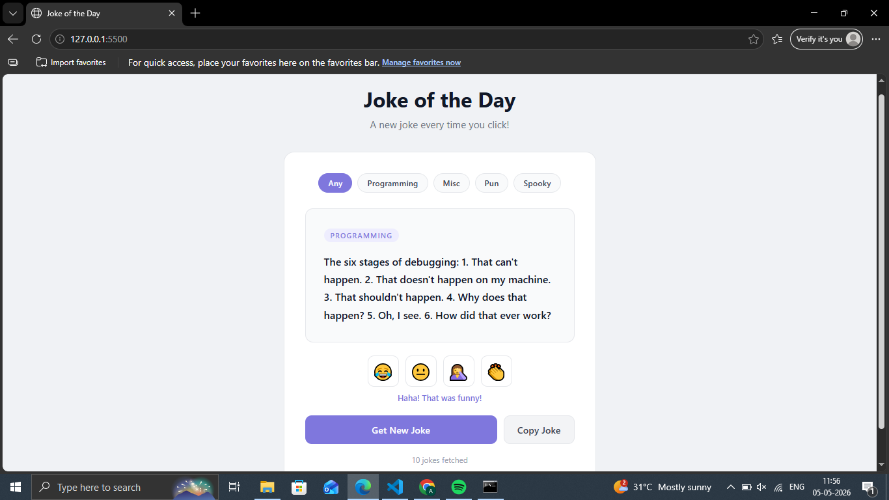

# Day 15 — Joke of the Day

A joke fetcher app using the JokeAPI with category filter and punchline reveal.

## Preview

## Features
- Fetches jokes from JokeAPI (free, no key needed)
- Filter by category — Any, Programming, Misc, Pun, Spooky
- Two-part jokes with hidden punchline reveal
- Emoji reaction buttons
- Copy joke to clipboard
- Joke counter tracks total fetched
- Loading spinner while fetching

## Tech Stack
- HTML5
- CSS3 (animations, transitions)
- JavaScript (fetch API, async/await, DOM)

## API Used
- [JokeAPI](https://v2.jokeapi.dev) — free, no key required

## What I Learned
- Using fetch() and async/await to call an API
- Handling JSON responses
- Showing loading states while data loads
- Error handling with try/catch

## Part of
[30 Days 30 Projects](https://github.com/anmisha-dash/30-days-30-projects) challenge